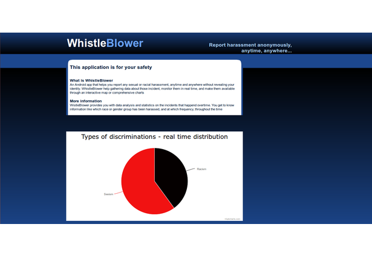

<h1>WhistleBlower</h1>

Tagline: Report Any Discrimination Anonymously, Anytime, Anywhere...

<h2>Description</h2>

Lots of people have been sexually harassed on college campuses, but stayed silent about it. There has been very little done to prevent that, but not anymore with WhistleBlower!
  
WhistleBlower is an Android app that lets you report any discrimination or sexual harassment incidents on college campus anonymously. Just enter when, where and what happened using our friendly user interface anonymously. WhistleBlower will store these reports in a Firebase that is synchronized in real time with our website to provide live feeds and statistics on the reports within specific time, place or group. WhistleBlower also lets you know on which sites these incidents happened through an interactive google map and lists the time and dates of these incidents.
  
The app is intended to educate people and organizations about the frequencies of sexual or racial discrimination in any region around the world. Schools and governments can use these statistics to see if their policies are effective. Individuals can use the information to take precaution. By realizing that they are not alone, victims would be more confident to stand forward and voice their concerns. 
  
Future enhancements may include prediction analysis and/or machine learning to predict where the next occurrence of the sexual harassment would be in the future. 

